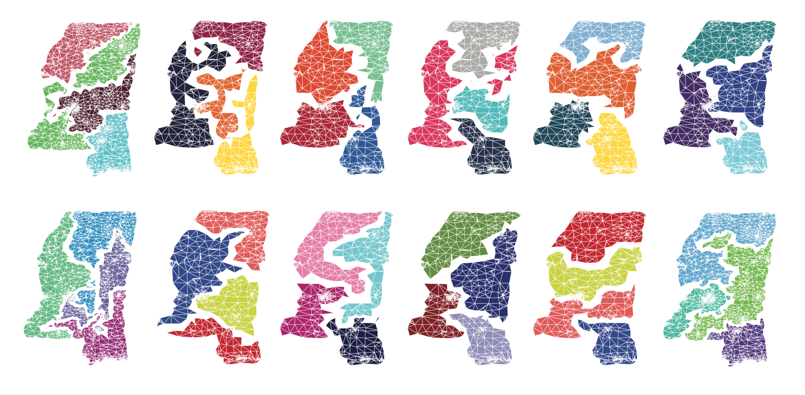

# Mississippi
A short set of scripts that make pretty maps of Mississippi.



## Installation
Clone this repository, then just run `$ make`. Everything will be set up for you,
so you'll be all set to use the code right away.

## Examples
To see visual examples of the maps generated _without_ having to go through
the below steps, the `packs/` directory has zipped example maps.

## Usage
Most of these scripts are auxiliary and perform a specific set of tasks; this
task is denoted in a block comment at the top of each script. The only script
in this package that's truly ready for general use is the `walk` script, which
samples partitions (or, in other words, districting plans) based on our tree-walk
model. As an example, let's use Mississippi's Census tracts.

### Retrieving Data
To retrieve the proper data, we can run `retrieve_data.py` by opening up a
command line instance and running

`$ python retrieve_data.py`

This will download the required data from the US Census and create a
shapefile augmented with this data. This is important, as we are relying on the
census to provide us with demographic data central to the motive of this project.
To see other accessible data columns, use [this database](http://bit.ly/2OEABto).

### Saving Data
After getting the above data, we can generate a dual graph and augment _that_
with the data we assigned to the shapefile. Just run

`$ python save_graph.py`

to do this. Essentially, we find data points in the shapefile and assign them to
the proper vertex in the dual graph (alongside geographic data).

### Walking
Now we should be able to walk! Make sure to set the `walk.py` script up to
use the correct shapefile and graph data. The default variables should be set to:

```python
# Paths to files.
graph_path = "./data/graph_data.json"
shp_path = "./data/tl_2016_28_tract_merged/tl_2016_28_tract_merged.shp"

# Demographic data column names.
total_pop_column = "POP10"
black_pop_column = "BPOP"
```

That's it! The code will run and automatically generate beautifully colored maps.